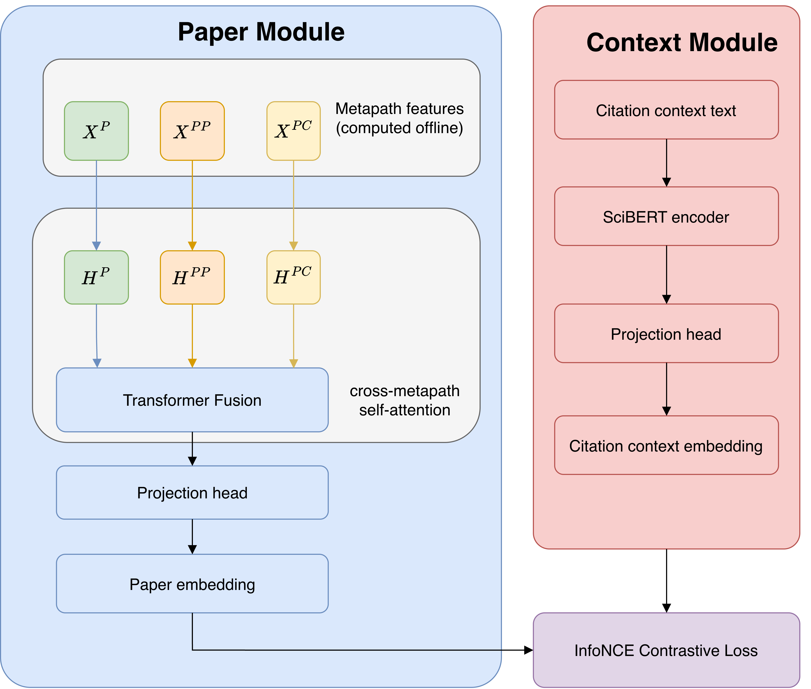

# Local Citation Recommendation via Heterogeneous Graph Neural Networks and Contrastive Learning


<p align="center">
  
</p>

## Repository Structure

```
SeHGNN/
├── train_baseline.py            # Baseline (P-only) training entry point
├── train_domain_specific.py     # Full training entry point (ArgKG / ACL-200, configurable feature set)
├── evaluate.py                  # Recall@n / group-aware MRR evaluation
├── infer.py                     # Inference / candidate ranking for a given citation context
│
├── paper_tower/
│   └── model.py                 # Paper Module: per-metapath MLPs + transformer fusion + projection head
├── context_tower/
│   └── model.py                 # Context Module: SciBERT encoder + projection head
│
├── data_preprocessing/          # SKG construction pipeline (Flask app + n8n workflows + RML mapping)
│   ├── requirements.txt
│   ├── mapping.rml.ttl
│   ├── Pipeline 1 – Reference Cleaning + CiteKG Generation.json
│   ├── Pipeline 2 - Context Extraction.json
│   ├── Pipeline 3 - KG Creation.json
│   ├── routes/
│   └── services/
│
├── shared/
│   ├── data_prep/                # ArgKG: graph construction → feature propagation (step1 → step5b)
│   └── acl200_prep/              # ACL-200: same stage structure (step1 → step4b)
│
├── configs/                      # Experiment configs, checkpoints, and training reports
│   ├── make_report.py            # Generates HTML reports (Recall@10 / MRR) across configuration runs
│   ├── P/, PP/, PPCon/, P+PP/, P+PPCon/, P+PP+PPCon/
│   └── acl200/
│
└── figures/
```

## Requirements

- Python 3.10+
- Docker (only needed if regenerating the knowledge graph from raw data via RML Mapper)

## Setup

Clone the repository and set up a virtual environment:

```bash
git clone https://github.com/Ba-aH/HGNN.git
cd SciteKG

python -m venv venv
on linux: source venv/bin/activate    
on Windows: venv\Scripts\activate

pip install -r requirements.txt
```

> **Note**: `requirements.txt` that lives under `data_preprocessing/`. is for the pipeline for data preprocessing using the provided n8n-pipelines create another specific python enviroment following for it the same instruction as above.

## Reproducing the Results

### 1. Get the data

Both `shared/data_prep/` (ArgKG) and `shared/acl200_prep/` (ACL-200) ship with zipped data files. Unzip each `.zip` file in place before running anything:

```bash
cd shared/data_prep
unzip merged-kg.zip
unzip all_contexts.zip

cd ../acl200_prep
unzip abstracts.zip
unzip all_contexts.zip
```

### 2. Build the graph and propagate features

For ArgKG:

```bash
cd shared/data_prep
python step1_build_graph.py
python step2_encode_corpus_papers.py
python step3_encode_external_papers.py
python step4_assemble_and_propagate.py
python step5a_encode_citations.py
python step5b_propagate_PCCon.py
python freeze_split.py        # freezes split_uris.json for reproducibility across runs
```

For ACL-200:

```bash
cd shared/acl200_prep
python step1_build_graph.py
python step2_encode_papers.py
python step3_propagate.py
python step4a_encode_citations.py
python step4b_propagate_PCCon.py
```

### 3. Train

Each experiment is defined by a `config.json` file under `configs/<feature_set>/...`. Point the training script at the config you want to reproduce:

```bash
python train_domain_specific.py --config configs/P+PP/MLP_500/exp_PP_MLP_hidden500\(run1\)/config.json
```

To reproduce a specific row of the results table, pick the matching config folder — e.g. `configs/P/`, `configs/PP/`, `configs/PPCon/`, `configs/P+PP/MLP_500/`, `configs/P+PPCon/`, `configs/P+PP+PPCon/`, or `configs/acl200/`. Checkpoints and training history (`best_model.pt`, `history.json`, `test_curve.json`) are written back into that same experiment folder.

#### Configuration files

Every `config.json` fully specifies one run — paths, model hyperparameters, and optimization settings — so a run can be reproduced (or modified) just by editing/pointing to a config, without touching any code. Example:

```json
{
  "data_root": "~/HGNN/shared/acl200_prep",
  "output_dir": "~/HGNN/configs/P+PP/acl200",
  "experiment_name": "exp_PP_MLP_hidden500",
  "feat_keys": ["P", "PP"],

  "embed_dim": 768,
  "hidden": 500,
  "use_mlp": true,
  "n_fp_layers": 2,
  "num_heads": 1,
  "act": "none",
  "residual": true,

  "dropout": 0.25,
  "input_drop": 0.25,
  "att_drop": 0.1,

  "temperature": 0.07,
  "batch_size": 128,
  "max_length": 256,
  "epochs": 35,
  "patience": 35,
  "eval_every": 1,
  "test_eval_every": 5,

  "lr_scibert": 2e-6,
  "lr_head": 0.001,
  "lr_paper": 0.001,

  "seed": 42,
  "gpu": 0,
  "scibert_model_name": "allenai/scibert_scivocab_uncased"
}
```

Key fields, grouped by what they control:

| Field | Meaning |
|---|---|
| `data_root` | Path to the preprocessed dataset (output of the graph-building steps in [Section 2](#2-build-the-graph-and-propagate-features)) |
| `output_dir` | Where checkpoints and logs for this run are written |
| `experiment_name` | Name used for the run's output subfolder |
| `feat_keys` | Which metapath features to use — any combination of `"P"`, `"PP"`, `"PC"` (e.g. `["P", "PP"]` reproduces the P+PP row) |
| `embed_dim` | Final embedding size of both towers (kept fixed at 768) |
| `hidden` | Hidden size of the per-metapath `LinearPerMetapath` projection and the fusion transformer |
| `use_mlp` | Whether metapath features are projected through `LinearPerMetapath` (768 → `hidden`) before fusion, or fed directly into the transformer |
| `n_fp_layers` | Number of `LinearPerMetapath` projection layers inside the Paper Module |
| `num_heads` | Number of attention heads in the cross-metapath fusion transformer (`1` = no multi-head attention) |
| `act` | Activation applied to attention scores before softmax (`none`, `sigmoid`, `relu`, `leaky_relu`) |
| `residual` | Whether to add a skip connection from `mean(inputs)` into the fused representation |
| `dropout` / `input_drop` / `att_drop` | Dropout on activations / input features / attention weights inside the Paper Module (train-time only) |
| `temperature` | InfoNCE temperature; lower = sharper, more sensitive loss (0.07 is the standard contrastive-learning default) |
| `batch_size` | Citation records per training batch |
| `max_length` | Max tokens read by SciBERT per citation context |
| `epochs` / `patience` | Max training epochs / early-stopping patience |
| `eval_every` / `test_eval_every` | Validation / test evaluation frequency (in epochs) |
| `lr_scibert` | Learning rate for SciBERT's own weights (kept very low to fine-tune gently rather than retrain) |
| `lr_head` / `lr_paper` | Learning rate for the (randomly initialized) projection head and Paper Module weights |
| `seed` | Random seed for reproducibility |
| `gpu` | GPU index to train on |
| `scibert_model_name` | HuggingFace model id used for the Context Module encoder |

To run a new configuration, copy an existing `config.json`, adjust the fields above (most commonly `feat_keys`, `hidden`, and `experiment_name`), and pass its path to `--config`.

### 4. Evaluate

```bash
python evaluate.py --checkpoint configs/P+PP/MLP_500/exp_PP_MLP_hidden500\(run1\)/best_model.pt --dataset argkg
```

This reports Recall@n and group-aware MRR on the frozen test split.

### 5. Generate the sweep report

```bash
python configs/make_report.py
```

Produces an HTML report summarizing Recall@10 / MRR across all experiment folders under `configs/`.


## Rebuilding the KG from Raw Data

If you want to reconstruct the knowledge graph from raw scraped papers instead of using the preprocessed release:

```bash
cd data_preprocessing
python -m venv venv
source venv/bin/activate
pip install -r requirements.txt
python app.py
```

This starts the preprocessing service (reference cleaning, context extraction, RML mapping via Docker). Import and run `Pipeline 1`, `Pipeline 2`, and `Pipeline 3` (n8n workflow JSON files in this folder) in order.