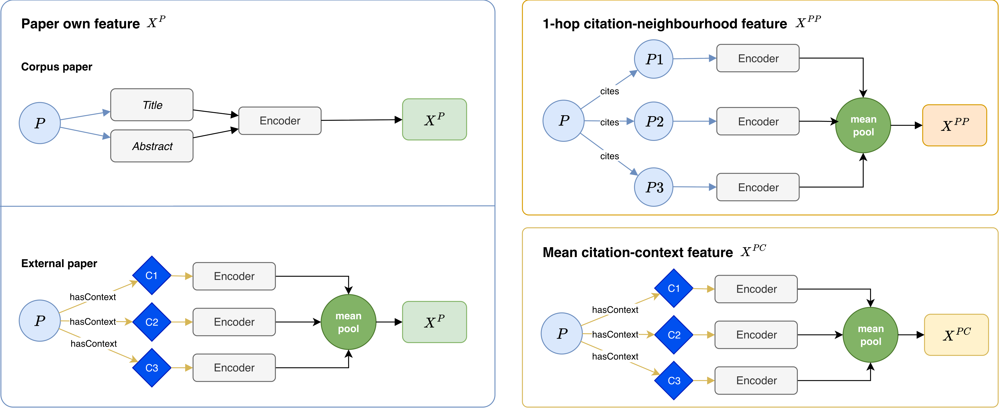

# Paper Module (`paper_tower/`)

Encodes a candidate paper into a fixed-dimensional embedding (`d = 768`) by combining three metapath-based feature vectors extracted from the knowledge graph, fusing them with a transformer, and projecting the result onto the shared embedding space used for contrastive training.

## Metapath Features

A metapath is a typed path over the knowledge graph (e.g. `Paper --cites--> Paper`) that captures a specific structural relationship between a paper and its neighbourhood. Three metapaths are used to represent each candidate paper:

  

- **XP** — own content (metapath `P`)
  SciBERT encoding of the paper's own title + abstract. For papers without an abstract (external papers), this falls back to the mean-pooled SciBERT encoding of all citation contexts in which the paper is cited.

- **XPP** — 1-hop citation neighbourhood (metapath `P --cites--> P`)
  Mean-pooled SciBERT encoding of the papers directly cited by this paper (`P1`, `P2`, `P3`, ...), capturing its topical context through its reference list.

- **XPC** — citation-context neighbourhood (metapath `P --hasContext--> C`)
  Mean-pooled SciBERT encoding of all citation contexts (`C1`, `C2`, `C3`, ...) in which this paper is cited elsewhere in the corpus.

All three are precomputed offline and cached, so the Paper Module itself only performs the fusion step at training/inference time.

## Fusion

1. **Per-metapath projection** — each of `X^P`, `X^PP`, `X^PC` is passed through its own two-layer MLP (no shared parameters), producing `H^P`, `H^PP`, `H^PC`.
2. **Transformer fusion** — the three projected vectors are stacked and passed through a self-attention layer, letting each metapath attend to the others, so the model can weight each one's contribution per paper.
3. **Projection head** — the fused representation is projected and ℓ2-normalised, giving the final paper embedding used in the InfoNCE contrastive loss against the Context Module's output.

